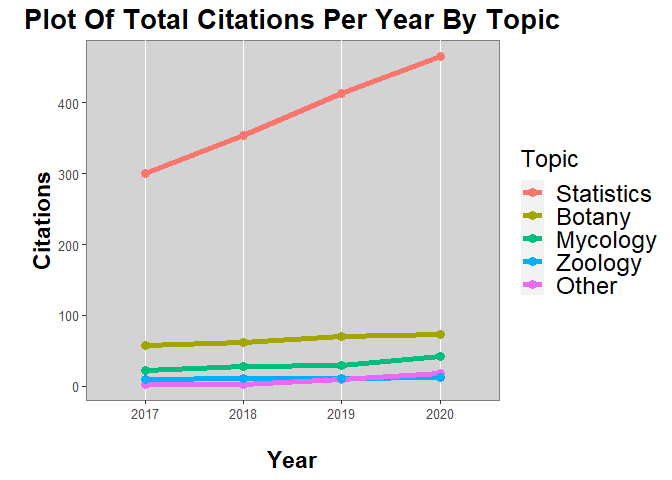
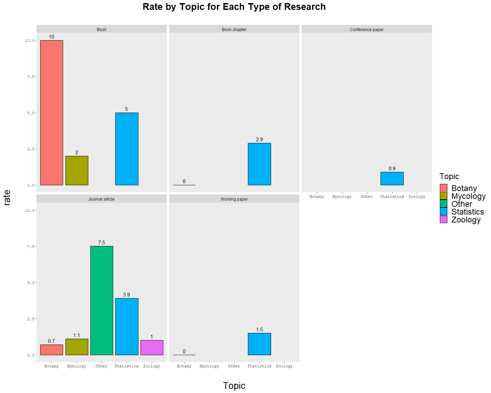
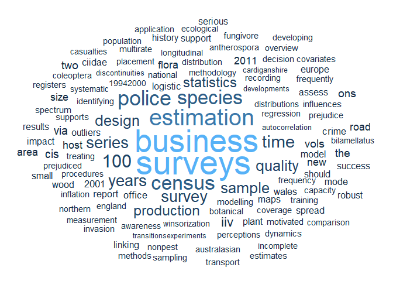

University Project : Data Visualisations
================

<style>
blockquote {
    padding: 10px 20px;
    margin: 0 0 20px;
    font-size: 13.5px;
    border-left: 5px solid #eee;
}

body {
text-align: justify;
font-size: 14pt;
}

body .main-container {
max-width: 3600px;
}

</style>

------------------------------------------------------------------------

# Introduction

This file provides all the codes and brief summaries of the write up for
my university module “Data Visualisation”. The full word document can be
[found
here](https://github.com/702BH/University-Project-Data-Visualisations/blob/main/Data%20Visualisation%20Assignment.pdf),
providing a higher level of writing.

# Outline

For this University Module I was required to take the following text
file (provided raw data) and create a meaningful and informative plot:

    ##                                                                        Title
    ## 1 Autocorrelation in logistic regression modelling of species' distributions
    ##   Year      Topic            Type X02.11.2017 X21.11.2017 X14.12.2017
    ## 1 1994 Statistics Journal article         131         131         131
    ##   X02.01.2018 X01.02.2018 X02.03.2018 X01.04.2018 X01.05.2018 X01.06.2018
    ## 1         131         135         135         135         137         137
    ##   X01.07.2018 X01.09.2018 X01.10.2018 X01.11.2018 X01.12.2018 X01.01.2019
    ## 1         138         140         140         139         141         142
    ##   X01.02.2019 X01.03.2019 X01.04.2019 X01.05.2019 X01.06.2019 X01.07.2019
    ## 1         143         141         142         143         144         144
    ##   X01.09.2019 X01.10.2019 X01.11.2019 X01.12.2019 X02.01.2020 X01.02.2020
    ## 1         143         143         144         145         147         149
    ##   X01.03.2020 X01.04.2020 X01.05.2020 X01.06.2020 X01.07.2020 X01.08.2020
    ## 1         149         149         150         151         152         152
    ##   X01.09.2020 X06.10.2020 X01.11.2020 X01.12.2020
    ## 1         152         154         154         154

The data provides information on the number of ‘citations’, ‘title’,
‘year’, ‘topic’ and ‘type’ for a variety of published material. As can
be seen this data was not in a valid tidy data format and had to be
prepared.

# Visualisation 1

## Preparation

Checking for missing data, 2115 missing values were found. These were
replaced with 0.

``` r
# Checking na
sum(is.na(data))
```

    ## [1] 2115

``` r
# replacing Na with 0
data[is.na(data)] <- 0
```

Next, the columns of interest were selected and required renaming. The
data is now in a significantly better format for plotting.

``` r
# Selecting required columns end of year data
keep <- c(1,2,3,4,7,18,29,41)
data.vis1 <- data[keep]

# rename
data.vis1 <- data.vis1 %>%
  rename('2017' = X14.12.2017,
         '2018' = X01.12.2018,
         '2019' = X01.12.2019,
         '2020' = X01.12.2020)

# pivot longer
data.vis1 <- data.vis1 %>%
  pivot_longer(c('2017', '2018','2019','2020'), 
               names_to = "year of citation", 
               values_to = "citations")
```

``` r
kable(head(data.vis1,2))
```

| Title                                                                      | Year | Topic      | Type            | year of citation | citations |
|:---------------------------------------------------------------------------|-----:|:-----------|:----------------|:-----------------|----------:|
| Autocorrelation in logistic regression modelling of species’ distributions | 1994 | Statistics | Journal article | 2017             |       131 |
| Autocorrelation in logistic regression modelling of species’ distributions | 1994 | Statistics | Journal article | 2018             |       141 |

Finally, the plot data was prepared.

``` r
# new plot data for topics
plot.data <- data.vis1 %>%
  group_by(`year of citation`, Topic) %>%
  summarise(sum.citations = sum(citations)) %>%
  ungroup()
plot.data <- data.frame(plot.data)

# reorder
plot.data$Topic <- reorder(plot.data$Topic, -plot.data[,'sum.citations'])
```

## Plot 1

The first visualisation displays a line chart of the total citations for
each year from 2017-2020 for each research paper topic. From this plot
it may be reasonable to suggest that papers of the “Statistics” topic
showed the greatest growth from 2017-2020 and the highest total
citations for each year. This suggests that this topic is the most
popular in terms of citations. It can also be seen that the other topics
present showed only very small growth in comparison.

However, this visualisation does not display the change in a form that
allows for fair comparison across the topics.This topic had
significantly more citations at the start of the time period and
contains the most papers at 63, which will obscure the patterns present
in the other topics.

``` r
ggplot(data=plot.data, aes(x=year.of.citation, y=sum.citations, group=Topic)) + 
  geom_line(aes(color = Topic ), size=2) +
  geom_point(aes(color = Topic), size = 3) +
  theme(panel.background = element_rect(fill = "lightgrey", colour = "grey50"),
        panel.grid.major.y = element_blank(),
        panel.grid.minor.y = element_blank(),
        legend.text = element_text(size=18),
        legend.title = element_text(size=18),
        axis.text = element_text(size=10),
        axis.title = element_text(size=17, face="bold"),
        legend.position = "right",
        plot.title = element_text(hjust=0.5, size = 20, face="bold")) +
  ggtitle("Plot Of Total Citations Per Year By Topic") +
  xlab("\nYear") +
  ylab("\nCitations")
```

<!-- -->

# Visualisation 2

## obtaining data

``` r
# obtaining the change and total papers
topic.growth <- data %>%
  group_by(Topic, Type) %>%
  summarise(change = sum(X01.12.2020 - X02.11.2017),
            paper = n()) %>%
  ungroup()

# obtaining the rate of citation gains per paper
topic.growth <- topic.growth %>%
  mutate(rate = round(change/paper,1))

# Re order
topic.growth <- arrange(topic.growth, desc(rate))
head(topic.growth,2)
```

    ## # A tibble: 2 x 5
    ##   Topic  Type            change paper  rate
    ##   <chr>  <chr>            <dbl> <int> <dbl>
    ## 1 Botany Book                10     1  10  
    ## 2 Other  Journal article     15     2   7.5

## Plot 2

``` r
# Final Plot
ggplot(topic.growth, aes(x=Topic, y=rate, fill=Topic)) +
  geom_bar(stat="identity", position = position_dodge(preserve = "single"),
           color="black") +
  geom_text(aes(label=rate), position = position_dodge(width=0.8), vjust=-0.5) +
  facet_wrap(~Type) +
  ggtitle("Rate by Topic for Each Type of Research") + 
  theme(panel.grid.major = element_blank(), 
        panel.grid.minor = element_blank(),
        legend.text = element_text(size=18),
        legend.title = element_text(size=18),
        plot.title = element_text(family="sans",hjust=0.5, size = 20, face="bold",margin=margin(0,0,30,0)),
        axis.title.x = element_text(family = "sans", size = 20, margin=margin(30,0,0,0)), 
        axis.title.y = element_text(family = "sans", size = 20, margin=margin(0,30,0,0)), 
        axis.text = element_text(family = "mono", size = 9),)
```

<!-- -->

Visualisation 2 attempts to overcome the limitations and issues present
within the first visualisation. This visualisation presents the data in
a new dimension and presents more levels of information to the user.

The new dimension presented is a way to standardise the citations to
make meaningful comparisons across the different categories. This
standardisation, which will be referred to as rate, was calculated by
taking the difference between the last available citation and the first
available citation and dividing this difference by the number of papers
for that given category (01.12.2020 – 02.11.2017 / papers). This was to
account for differences in the amount of papers produced between the
different topics. This visualisation is separated by the topic of the
research and the type of research, utilising a facet wrap.

This presents information to the user which would otherwise be hidden,
for example, it can be seen that for the types of research ‘Book
Chapter’, ‘Conference Paper’, and ‘Working Paper’ the only topics of
research were Statistics and Botany (Book Chapter and Working Paper
only).

The conclusions that can be drawn from this visualisation are different
from those of the first visualisation and emphasises the importance of
analysing and exploring many dimensions and levels of data. These
results suggest that for research of type Journal Article the topic of
“other” showed the greatest rate of citation gain per paper followed by
Statistics, the topic of Botany showed the lowest rate.

# Visualisation 3

``` r
# obtaining the top 20 papers
cloud.data <- data$Title[1:20]

# Replacing all puncutation within each title
title.clean <- c()
for(string in cloud.data){
  current_word <- string
  replace_word <- str_replace_all(current_word, "[[:punct:]]", "")
  title.clean <- c(title.clean, replace_word)
}

# Splitting each title into words
words <- c()
for (word in title.clean){
  current_word <- word
  current_words <- strsplit(current_word, " ")[[1]]
  words <- c(words, current_words)
}


# converting title words to text
write.table(words, file = "word.txt", sep = "", 
            row.names = FALSE)


# Loading the text
text <- readLines("word.txt")

# Load the data as a corpus
docs <- Corpus(VectorSource(text))

# Cleaning the text
# removequotes
removeSpecialChars <- function(x) gsub("[^a-zA-Z0-9 ]","",x)
docs <- tm_map(docs, content_transformer(removeSpecialChars))

# Remove english common stopwords
docs <- tm_map(docs, removeWords, stopwords("english"))

# Convert the text to lower case
docs <- tm_map(docs, content_transformer(tolower))

# Eliminate extra white spaces
docs <- tm_map(docs, stripWhitespace)

# Build a term document matrix
dtm <- TermDocumentMatrix(docs)
matrix <- as.matrix(dtm)
sorted.matrix <- sort(rowSums(matrix), decreasing = TRUE)
word.data.frame <- data.frame(word = names(sorted.matrix), freq = sorted.matrix)

# Generate the word cloud
set.seed(1234)

ggplot(data=word.data.frame, aes(label=word, size = freq, color=freq)) +
  geom_text_wordcloud_area(rm_outside = TRUE, eccentricity = 1) + 
  scale_size_area(max_size = 15) +
  theme_minimal() +
  scale_color_gradient()
```

<!-- -->

To answer the question of why these trends exist a word cloud was
generated for the titles of the 20 highest cited papers. This was done
to identify the themes of these papers to perhaps provide insight into
why they performed well. From this plot it is clear the most occurring
words are business, surveys, estimation, and species and may indicate
potential future research themes and areas to generate more citations.
